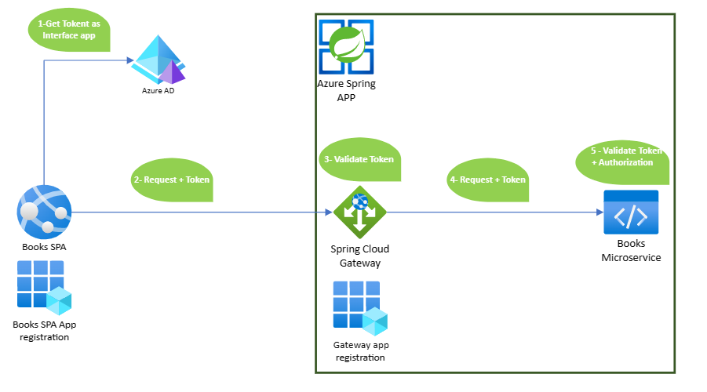
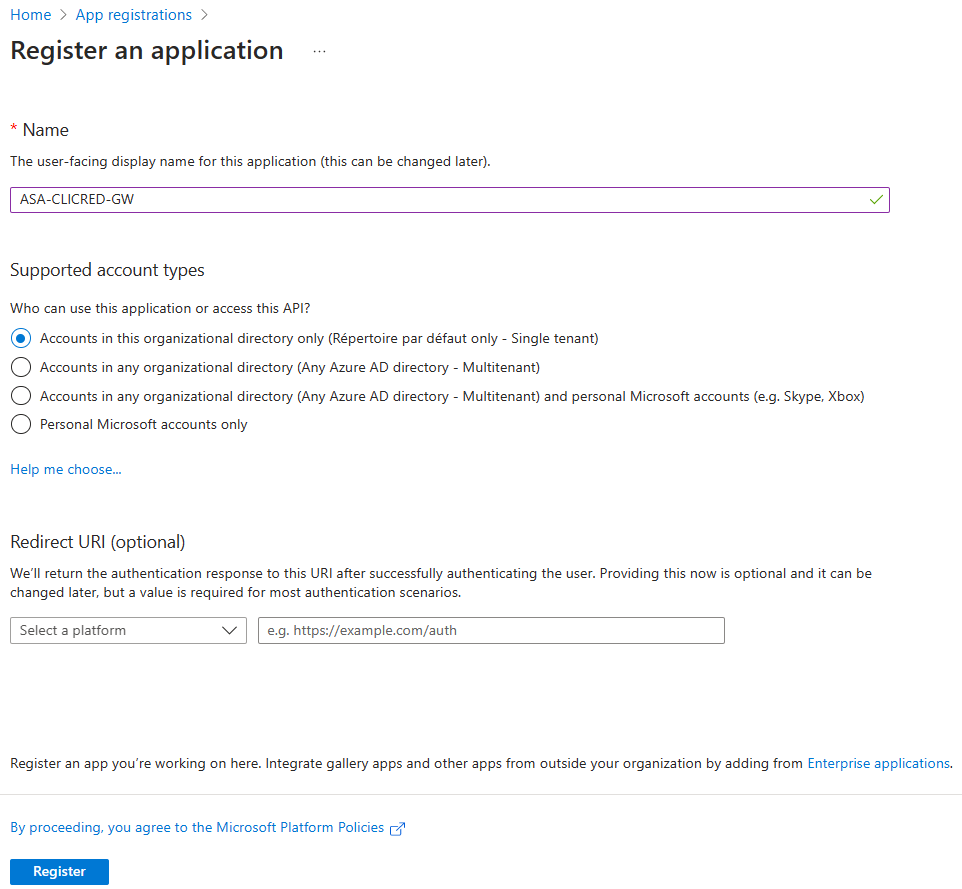
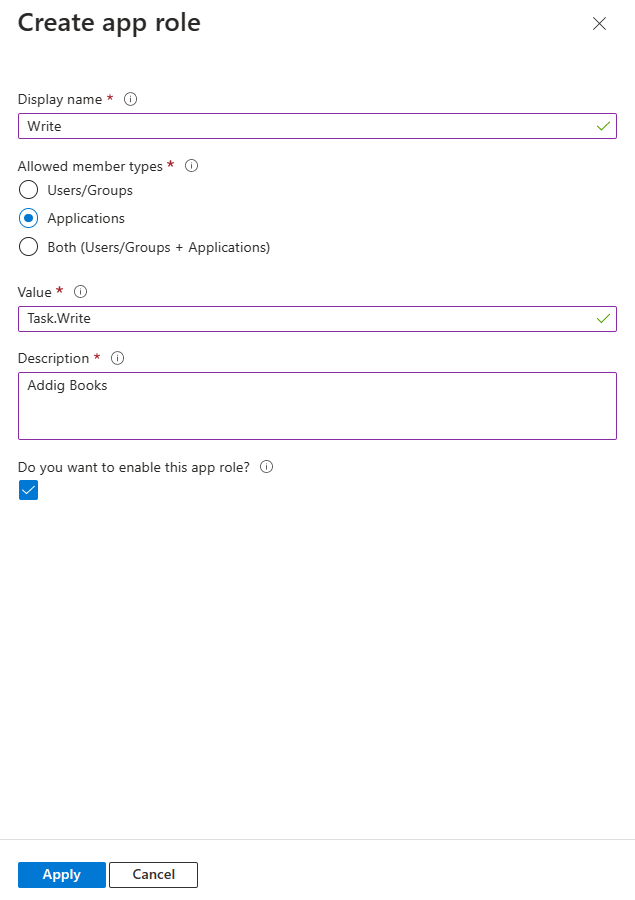
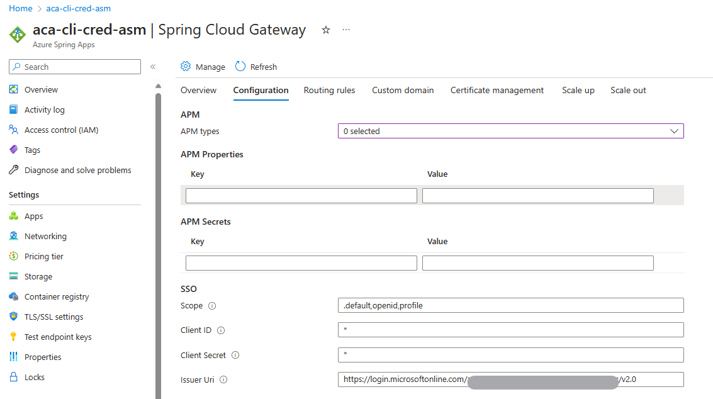
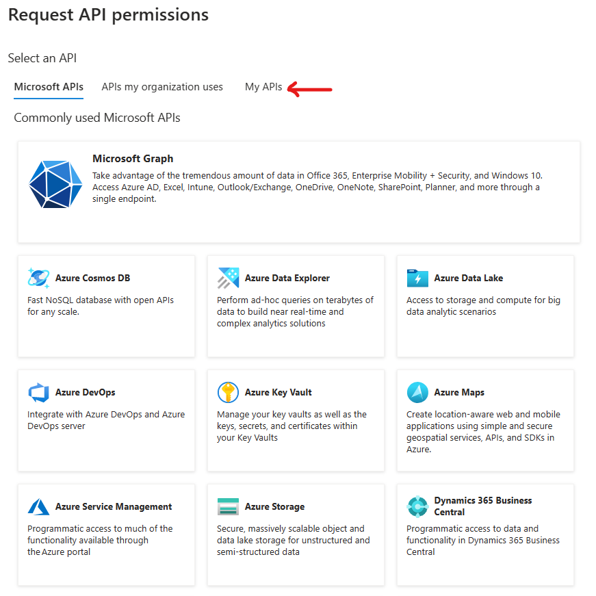
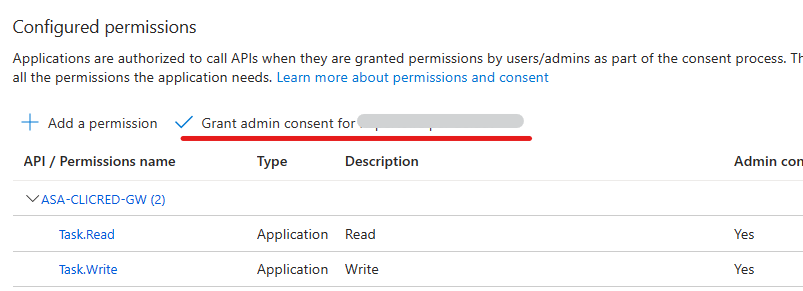

# Comprehensive Security with Azure Spring Apps, Spring Cloud Gateway SSO, and Spring Security

This guide provides an illustrative example of comprehensive security implementation using Azure Spring Apps, Spring Cloud Gateway SSO, and Spring Security. This involves authenticating an application security principal to call microservices behind Azure Spring Apps Spring Cloud Gateway while managing both authorization and authentication processes.

## Architecture Overview 

The architecture of this example is demonstrated by a Books Application, consisting of the following components:

- **Books SPA**: This Single Page Application (SPA), hosted in Azure App service, interacts with the Books Microservice for adding or searching for books.
- **Books Microservice**: 
    - A Spring Boot REST microservice hosted in Azure Spring Apps, this service operates behind a Spring Cloud Gateway. It stores book information in an H2 database.
    - The Books Microservice exposes two REST endpoints: 
        - 'Add books' for saving books in an H2 database.
        - 'Get Book' for retrieving a book by ID.    

 <br/>
  Overview of Books Application

## Security Flow

The Books SPA and the Books Microservice communication are secured through the client credentials flow, utilizing the Spring Cloud Gateway. This flow is as follows:

<br/>

1- The Books SPA requests a token from Azure AD to call the Spring Cloud Gateway. This token represents the Books SPA App registration as an application security principal. <br/>
2 - The Books SPA transmits a request with the acquired token to the Books Microservice through the Spring Cloud Gateway. <br/>
3 - The Spring Cloud Gateway validates the received token. <br/>
4 - The Spring Cloud Gateway redirects the request (along with the token) to the Books Microservice. <br/>
5 - The Books Microservice validates the token and authorizes the request. <br/>

## Environment Setup

### Spring Cloud Gateway Configuration 

#### App Registration
First, we will configure the Spring Cloud Gateway app registration in Azure Portal:
- Navigate to App registrations -> New registration 
 

- After the Application is registered, retrieve the client ID from the app registration overview. This client ID will be necessary for configuring Spring Cloud Gateway.

- As we are using the client credentials flow, and the microservices behind Spring Cloud Gateway will be called by client applications security principals (i.e., the Books SPA in our case), we will define App roles for our Spring Cloud Gateway App registration. App roles are used for assigning permissions to users or apps, and are the recommended way for assigning permissions in the client credentials flow. For more details, refer to the [app roles documentation](https://learn.microsoft.com/en-us/azure/active-directory/develop/howto-add-app-roles-in-azure-ad-apps). 

- We will add 2 App roles: 'Task.Write' (allows the SPA to add books) and 'Task.Read' (allows the SPA to read a book by ID). To add these roles, navigate to the app registration, click on App roles and then on Add new Roles. 
   <br/>

- Next, add a client secret for the Spring Cloud Gateway App registration. To do so, navigate to Certificate & Secrets and click on New Client Secret. Make sure to copy your client secret as it will be needed in your Spring Cloud Gateway configuration. 

#### Spring Cloud Gateway Configuration:

##### Endpoint Assignment
- In Azure portal, go to your Azure Spring Apps instance, select Spring Cloud Gateway, and enable endpoint assignment on the overview page.
    <br/>

- Copy the endpoint URL, as it will be required for configuring the Redirect URI for the Spring Cloud Gateway app registration.


##### SSO Configuration
- Under the configuration tab, in the SSO section, configure the following:
    - Scope: .default, as we are using the client credentials flow (and not using a user sign in),  permissions will be managed with App roles, the .default scope is suitable in this case. For more details, refer to [.default scope documentation](https://learn.microsoft.com/EN-US/azure/active-directory/develop/scopes-oidc#the-default-scope) and [.default with client credentials](https://learn.microsoft.com/EN-US/azure/active-directory/develop/scopes-oidc#client-credentials-grant-flow-and-default).
    - ClientId: The client Id of the Spring Cloud Gateway App registration created in previous steps.
    - ClientSecret: The client secret of Id of the Spring Cloud Gateway App registration created in previous steps.
    - Issuer URI: https://login.microsoftonline.com/< your tenant ID >/v2.0. This URI asserts as its Issuer Identifier.
    

##### Routing Configuration

- The routing in the Spring Cloud Gateway will be configured next. In our routes configuration, we will enable SSO (for token validation for the route) and enable tokenRelay (so the token will be passed with the request to the destination microservice). The routes file is configured as follows, and is located under service/routes.

```json 
[
    {
      "predicates": [
        "Path=/books/add",
        "Method=POST"
      ],
      "filters": [
        "StripPrefix=0"
      ],
      "tags": [
        "books"
      ],
      "ssoEnabled": true,
      "tokenRelay": true
    },
    {
        "predicates": [
          "Path=/books/{id}",
          "Method=GET"
        ],
        "filters": [
          "StripPrefix=0"
        ],
        "tags": [
          "books"
        ],
        "ssoEnabled": true,
        "tokenRelay": true
      }
]

```
To apply these routes in spring cloud gateway execute the following command :

```
az spring gateway route-config update -g <resours-group> --name <route-name> --app-name <app-name>  --routes-file routes/books.json --service <Azure spring apps instance>

```
##### Redirect URI Addition 
As you have enabled SSO in Spring Cloud Gateway, Azure Ad will need to redirect the authentication response to Spring Cloud Gateway after validating the authentication token. Thus, you will need to add a redirect URI in your App registration. To do so:
- Go to the Spring Cloud Gateway app registration created earlier, click Authentication.
- Click on Add platform, choose Web and enter the url < your spring cloud gateway endpoint url >/login/oauth2/code/sso.

### Client App Configuration

#### Client App registration 

To enable The books SPA to call the books service with a token serving for authentication and authorization, we should first create an Identity for the books SPA, this identity is represented with the client APP registration. To create the client App registration follow these steps :

1. In Azure portal go to App registrations and create a new App registration :
     <br/>
    Copy the Client Id of the APP registration, as we will need it in the SPA's code for acquiring the token to call the books microservice.

2. Create a secret for the SPA App registration, Go to Certificate & Secrets and create a new Secret, copy the generated secret as you will need it in the SPA's code for acquiring the token to call the books microservice.

3. Assign permissions to the SPA's app registration to call the books service through the Spring cloud gateway, those permissions are represented by the Spring cloud Gateway's App Registration Roles, to do so :
    - In the SPA's app registration go to API permissions -> Add a permission
         <br/>
    - Under My APIs Tab select the Spring cloud Gateway App registration <br/>
         <br/>
    - Select the Task.Read and Task.Write Roles <br/>
         <br/>

4. Applications are authorized to call APIs when they are granted permissions by users/admins as part of the consent process, as we are using using the client credentials flow, we will grant Admin consent for these permissions, to do that click on Grant Admin consent (Admin rights is required for granting Admin consent) 
    

#### Client Application code

In the SPA, we will need to add the code for acquiring the token to be able to call the books service through the spring cloud gateway. For this purpose, we will need to use msal library. The [Msal](https://learn.microsoft.com/en-us/azure/active-directory/develop/msal-overview) library is available for multiple languages and for different auth flows.

As our SPA is a node APP, we need first to install msal node library
```shell
npm install @azure/msal-node
```
In The SPA code "server.js" Add msal configuration with your SPA app registration credentials. **Note** : For demo purpose, we are adding directly client secret in the code, and this is not a recommended way for managing secret, in your environments, it's recommended to use Azure keyvault for storing and retrieving your secrets

```javascript
const msalConfig = {
    auth: {
        clientId: "< SPA APP registration clientID>",
        authority: "https://login.microsoftonline.com/<Tenant ID>/",
        clientSecret: "< SPA APP registration clientSecred>",
    },
};

const cca = new msal.ConfidentialClientApplication(msalConfig);

```

Add a function for Aquiring token for the spring cloud gateway app registration scope

```javascript
const tokenRequest = {
    scopes: ["api://< Spring Cloud Gateway App registration ClientID > /.default"]
};
// Function to get token
async function getToken() {
    const response = await cca.acquireTokenByClientCredential(tokenRequest);
    console.log(response.accessToken);
    return response.accessToken;
}
```

Call the Books service with the aquired token
```javascript
    const url = SpringCloudGatewayURL + `/books/${id}`;

    try {
        const token = await getToken();
        const apiResponse = await axios.get(url, {
            headers: {
                Authorization: `Bearer ${token}`,
            },
        });
    }
    ...
```

### Books Microservice Configuration

With A Zero trust perspective, security is validated at every level, since  Enabled SSO with token relay, In this section we will configure the books microservice for validating the recieved authentication token and validating if the request is authorized for each Rest Endoint, for that we are going to use spring security

#### Spring Security configuration 

Fist we will add dependency for spring securty in pom.xml file 

```xml
        <dependency>
            <groupId>org.springframework.boot</groupId>
            <artifactId>spring-boot-starter-security</artifactId>
        </dependency>
        <dependency>
          <groupId>org.springframework.boot</groupId>
          <artifactId>spring-boot-starter-oauth2-resource-server</artifactId>
       </dependency>
```

We will then configure spring security Issuer URI

```yml
spring:
  security:
    oauth2:
      resourceserver:
        jwt:
          issuer-uri: https://login.microsoftonline.com/< your tenant ID> /v2.0

```

We will then Add the security configuration, 

```java
@Configuration
@EnableWebSecurity
@EnableGlobalMethodSecurity(prePostEnabled = true)
public class SecurityConfig extends WebSecurityConfigurerAdapter {

    @Override
    protected void configure(HttpSecurity http) throws Exception {
        http
            .authorizeRequests()
            .anyRequest().authenticated()
            .and()
            .oauth2ResourceServer()
            .jwt()
            .jwtAuthenticationConverter(jwtAuthenticationConverter());
    }

    private JwtAuthenticationConverter jwtAuthenticationConverter() {
        
        JwtGrantedAuthoritiesConverter converter = new JwtGrantedAuthoritiesConverter();
        converter.setAuthoritiesClaimName("roles");
        converter.setAuthorityPrefix("ROLE_"); 
    
        JwtAuthenticationConverter jwtAuthenticationConverter = new JwtAuthenticationConverter();
        jwtAuthenticationConverter.setJwtGrantedAuthoritiesConverter(converter);
        return jwtAuthenticationConverter;
    }
}
```
On the controller  we will put the needed Role for being able to call this endpoint 

```java

@RestController
@RequiredArgsConstructor
public class BooksController{
    private final BooksService booksService;


    @PreAuthorize("hasRole('Task.Read')")
    @GetMapping("books/{id}")
    public Book getBook(@PathVariable Long id){
        return booksService.getBook(id);
    }

    @PreAuthorize("hasRole('Task.Write')")
    @PostMapping("/books/add")
    public Book addBook(@RequestBody Book book){
        return booksService.saveBook(book);
    }

}
```